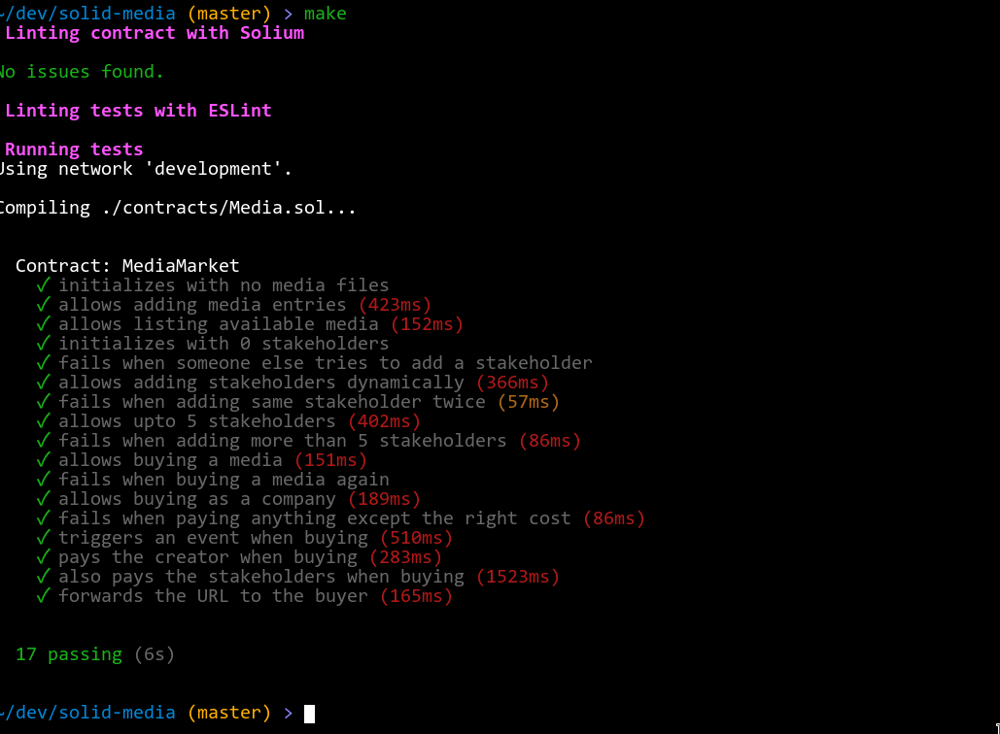

# Media.sol

An Ethereum smart contract for licensed media distribution. 



## Stack

* [Solidity](http://solidity.readthedocs.io/) for the core smart contract code.
* [Ganache](http://truffleframework.com/ganache/) to run a local Ethereum testnet. I used the GUI, but `ganache-cli` will work as well.
* [Truffle](https://github.com/trufflesuite/truffle) to manage the dev environment - compile contract, interact with local testnet and run tests.
* [Solium](https://github.com/duaraghav8/Solium) to lint the contract for style and security best practices.
* [Mocha](https://mochajs.org/) & [Chai](http://www.chaijs.com/) for writing unit tests.
* [ES Lint](https://eslint.org/) for linting the JS tests.
* ~~General HTML/CSS (Bootstrap)/JS for the Web UI.~~
* ~~[MetaMask](https://metamask.io/) as the bridge between the browser and the dapp?~~

## Building

```bash
git clone https://github.com/dufferzafar/solid-media
cd solid-media

make install

# Run Ganache!

make tmr

make test
```

## Resources

[Tutorial on an election app](https://www.youtube.com/watch?v=3681ZYbDSSk)

[Code from the tutorial](https://github.com/dappuniversity/election)

Off-chain processing:

- https://medium.com/hello-sugoi/ethereum-communicating-with-the-off-chain-world-789fea13163b

- [Crypto](https://github.com/pubkey/eth-crypto)

- https://ethereum.stackexchange.com/questions/3092/how-to-encrypt-a-message-with-the-public-key-of-an-ethereum-address

- https://ethereum.stackexchange.com/questions/15442/whats-a-recommended-way-to-pass-secret-in-solidity

## Grading by TA

We scored 19/20 on the assignment. 1 mark was deducted on some theoretical question that we didn't even understand.
